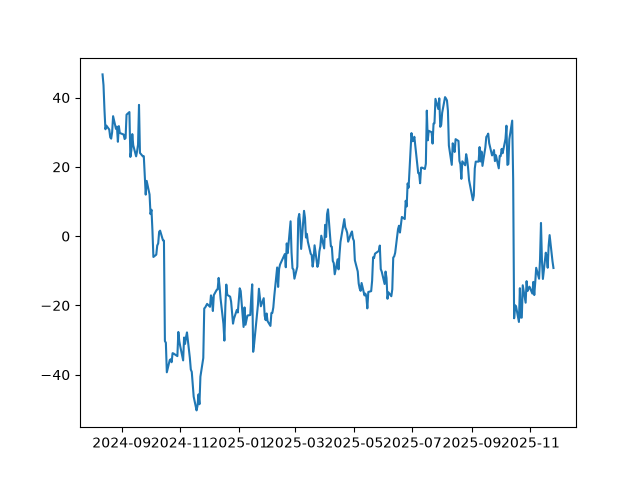

# Cointegrated Pairs Trading — GS/MS

This is a statistical arbitrage project I built to actually understand market microstructure and time-series statistics from the ground up, instead of just quoting terms I'd heard without knowing what they meant. I picked pairs trading specifically because every part of it — cointegration, regression, backtesting — is something I could derive and defend myself, rather than a black-box strategy borrowed from a paper.

## The idea

Two stocks that belong to the same business — same sector, same regulators, same macro exposure — tend to move together over time. Sometimes their price relationship drifts apart for a bit, and sometimes it snaps back. If you can identify a pair where that relationship is statistically real (not just eyeballed), you can bet on the snap-back: short the one that got expensive relative to the other, long the one that got cheap, and close out once the gap normalizes.

I ended up on **Goldman Sachs (GS)** and **Morgan Stanley (MS)** — about as clean a pair as large-cap equities get. Same business model, same regulatory environment, direct competitors in most of their lines of business.

## How it works

1. **Screen for a real relationship** — 30-day rolling correlation to get a first look, then the Engle-Granger cointegration test to check the relationship is statistically meaningful, not just visually similar
2. **Estimate a hedge ratio** — OLS regression of GS's price on MS's price, fit *only* on the training portion of the data (more on why that matters below)
3. **Build a signal** — track the spread between the two stocks, convert it to a rolling z-score, and trade when it moves too far from its own recent average (entry at ±2 standard deviations, exit near 0.4)
4. **Backtest it honestly** — a backtester I wrote myself, not a library, specifically so I could control exactly how positions are entered, priced, and closed, and make sure no trade ever uses information it couldn't have had at the time

## Why the train/test split matters

The first version of this fit the hedge ratio on the *entire* two years of data, which quietly meant every trade in the backtest was using a regression that had technically "seen" data from its own future. Fixing that meant splitting the data 65/35 — fit the hedge ratio only on the first 65%, then generate every signal and every trade for the remaining 35% using that one fixed ratio. That's the version these results are from.

## Results

|  | In-sample (train, 65%) | Out-of-sample (test, 35%) |
|---|---|---|
| Annualized Sharpe | 0.12 | 0.90 |
| Max drawdown | -6.01% | -2.86% |
| Trades | 18 | 8 |

The in-sample Sharpe (0.12) badly lagging the out-of-sample figure (0.90) surprised me at first — you'd expect a model to look at least as good on the data it was built from, not far worse. Plotting the training-period spread explained it: there are two stretches where the spread doesn't oscillate the way it does everywhere else, it just trends hard in one direction for weeks. A single fixed hedge ratio, averaged across the whole training window, can't handle those stretches well — it prices the "normal" relationship correctly most of the time and gets run over during the two regime shifts. The out-of-sample period didn't happen to contain a shift like that, which is a big part of why it performed better.



The two sharp, sustained drops — one in late 2024, one in late 2025 — are exactly the stretches where a fixed hedge ratio stops working. Everywhere else, the spread oscillates in a tighter, more well-behaved band, which is the kind of period this strategy is actually built for.

I'd rather report that honestly than tune the entry/exit thresholds until the in-sample number looks nicer — that would just be curve-fitting the past.

## What's next

- **More pairs** — right now this is one pair's result. Running the same pipeline across a handful of sector-matched pairs would tell me whether GS/MS was a good pick or just a lucky one.
- **A time-varying hedge ratio** — a Kalman filter would let the hedge ratio drift slowly with the data instead of staying fixed for the whole test period, which is the direct fix for the regime-shift problem above.

## Running it

```bash
pip install -r requirements.txt
python src/get_data.py       # pulls GS/MS price history
python src/backtest.py       # runs the cointegration test, generates signals, backtests
```

## Stack

Python, pandas, NumPy, statsmodels, matplotlib, yfinance
