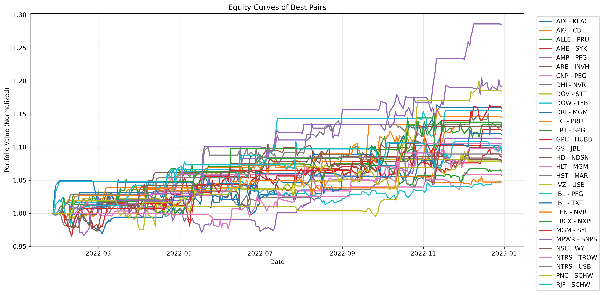
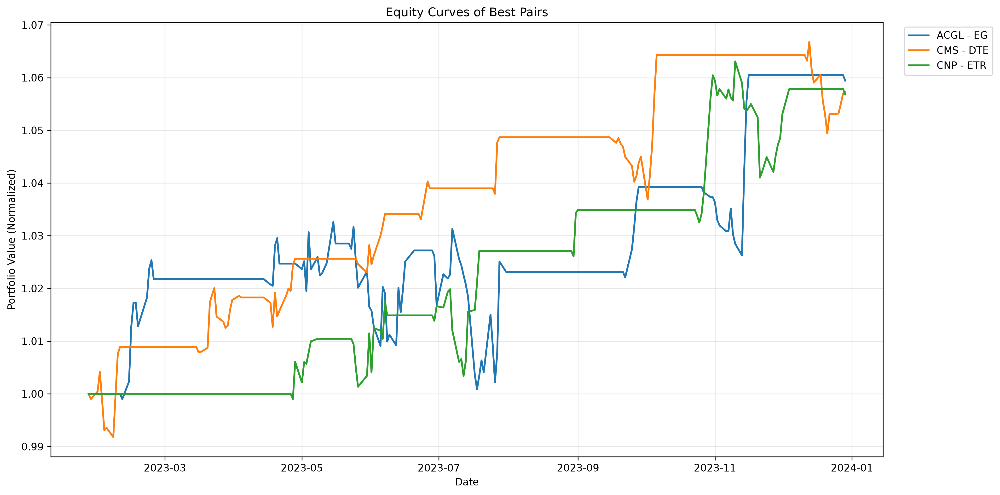
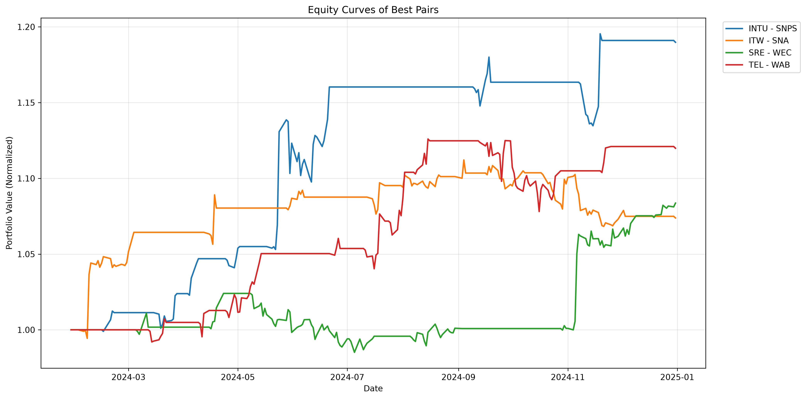
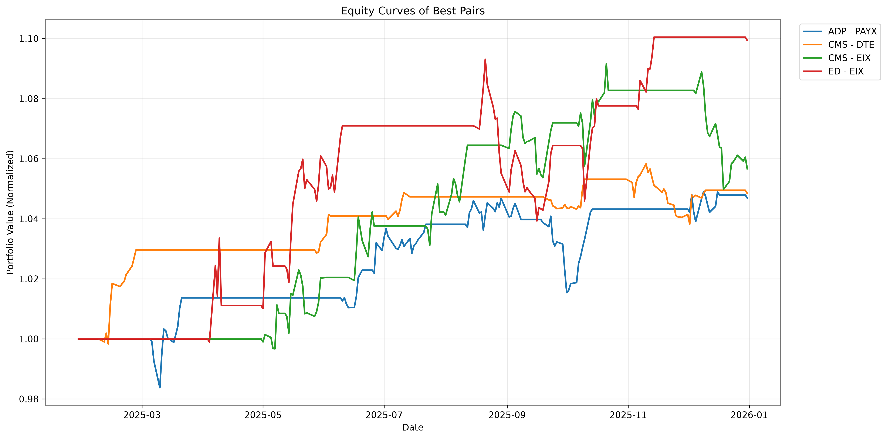
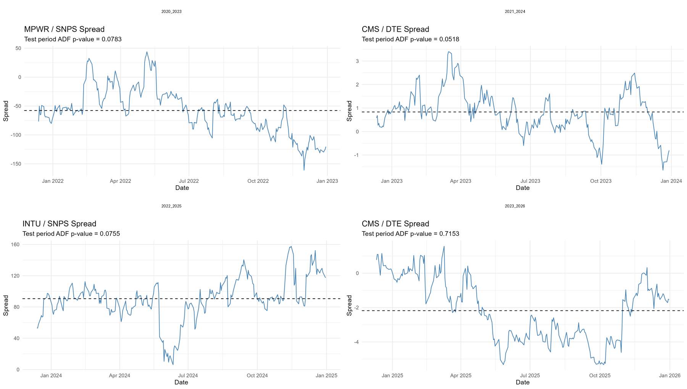
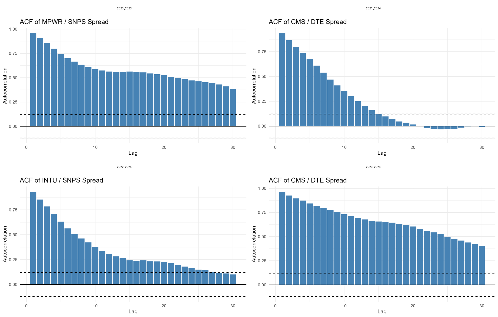
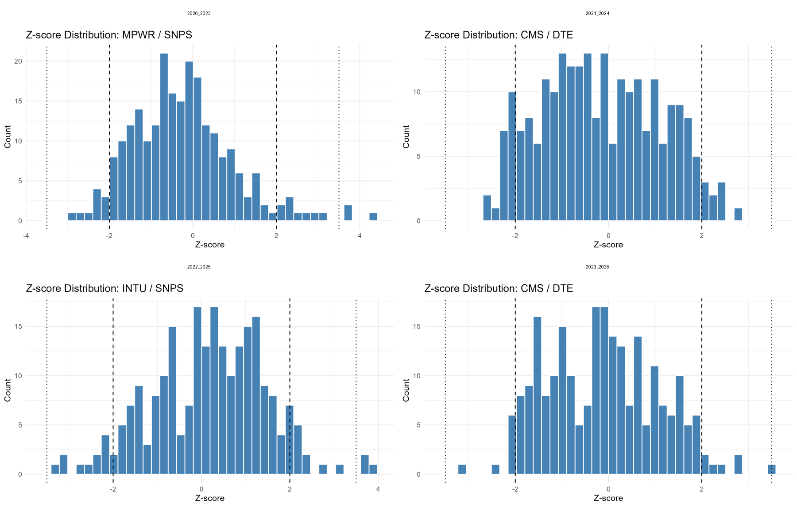
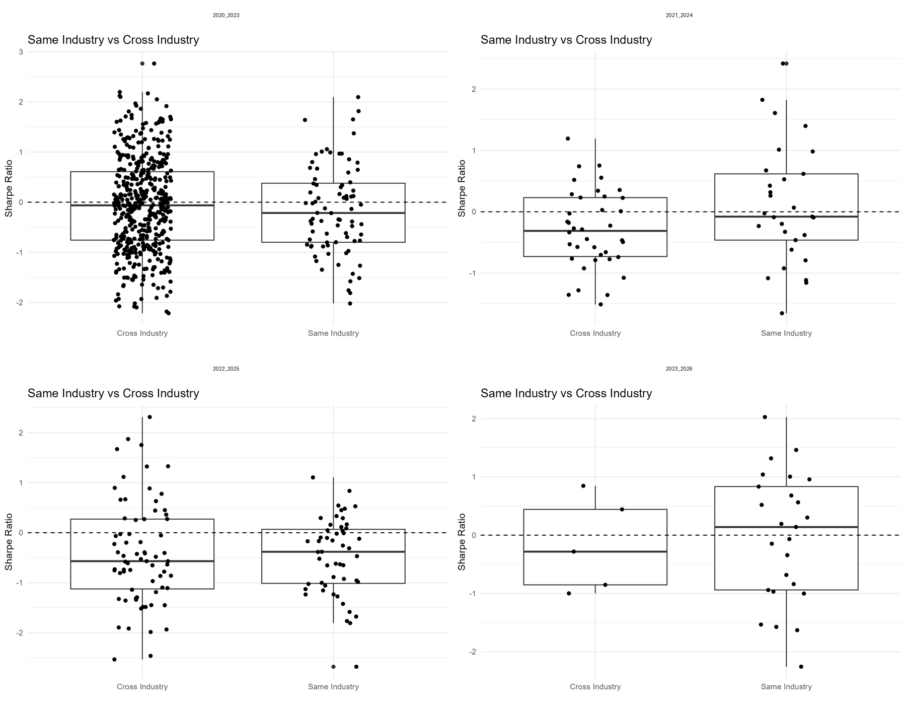

# How Much Cointegration Survives Multiple-Testing Correction?

**Cointegration-based pairs trading in the S&P 500, tested with and without Benjamini-Hochberg correction**

I screened S&P 500 stocks for potentially cointegrated pairs and investigated how much of the apparent statistical evidence survives when hundreds of hypotheses are tested simultaneously.

I use two related but different pipelines:

1. **Experiment 1:** correlation screening → Engle-Granger test → additional ADF filter → positive hedge-ratio filter → out-of-sample backtest.
2. **Experiment 2:** correlation screening → Engle-Granger tests on all candidate pairs → Benjamini-Hochberg (BH) correction → out-of-sample backtest of the surviving pairs.

In one Experiment 2 window, 67 of 591 candidate pairs passed the raw 5% Engle-Granger threshold, but only **2 survived BH correction at FDR 5%**. In another window, **0 of 751** survived.

The two BH survivors had negative out-of-sample Sharpe ratios. The average pair in the exploratory Experiment 1 windows also had a negative mean Sharpe ratio.

This is an undergraduate statistics project. It does **not** show that pairs trading works, and it does **not** show that pairs trading cannot work. It documents what this particular implementation produced on these data and test periods.

---

## Contents

- [Research Question](#research-question)
- [Why This Project?](#why-this-project)
- [Key Findings](#key-findings)
- [Visual Results](#visual-results)
- [Methodology](#methodology)
- [Experiment 1 — Rolling Windows](#experiment-1--rolling-windows)
- [Experiment 2 — Multiple Testing](#experiment-2--multiple-testing)
- [Why the "Best Pairs" Are Not Evidence](#why-the-best-pairs-are-not-evidence)
- [Robustness / Stability Across Windows](#robustness--stability-across-windows)
- [Industry Analysis](#industry-analysis)
- [Limitations](#limitations)
- [Repository Structure](#repository-structure)
- [Reproducibility](#reproducibility)
- [Future Work](#future-work)
- [Conclusion](#conclusion)
- [Requirements](#requirements)

---

## Research Question

When hundreds of stock pairs are tested for cointegration:

1. How much of the apparent statistical evidence survives multiple-testing correction?
2. Do statistically selected pairs produce useful out-of-sample trading results?
3. How stable are the selected relationships across different time windows?

---

## Why This Project?

**Pairs trading** is a hedged relative-value idea based on two securities whose prices are expected to maintain a long-run relationship.

A common implementation is:

- identify two related stocks,
- estimate a hedge ratio,
- construct a spread,
- wait for the spread to move unusually far from its recent level,
- take a position expecting it to revert.

A simple spread is:

```text
spread_t = P1_t − α − β · P2_t
```

where:

- `P1` = price of stock 1
- `P2` = price of stock 2
- `β` = hedge ratio
- `α` = intercept

### Cointegration vs correlation

Correlation and cointegration answer different questions.

Two stocks can have highly correlated returns while their price relationship drifts over time. Cointegration instead asks whether a linear combination of the two price series is stationary.

I therefore use:

- **return correlation** as a cheap first-stage screening mechanism;
- **Engle-Granger cointegration testing** for the statistical cointegration question.

### What "out-of-sample" means here

For every window, the first 65% of trading days is the **training set** and the last 35% is the **test set**. Everything that is estimated (correlations, cointegration tests, hedge ratios and intercepts) uses the training set only. The test set is used only to run the trading rule and measure performance. "Out-of-sample" in this README always means this test set.

### The multiple-testing problem

Suppose 591 genuinely non-cointegrated pairs are tested at a 5% significance level.

If the tests behaved independently under the null, approximately:

```text
591 × 0.05 ≈ 29.6
```

false rejections would be expected.

This is only a rough reference because the tests in this project are not independent.

A backtest that simply trades every pair with `p ≤ 0.05` can therefore contain many pairs that passed because of statistical luck.

### Benjamini-Hochberg correction

The **Benjamini-Hochberg (BH)** procedure controls the expected false discovery rate among rejected hypotheses under its assumptions.

At FDR 5%, BH makes the significance threshold depend on:

- the total number of hypotheses,
- the rank of each p-value.

For sorted p-values:

```text
p(1) ≤ p(2) ≤ ... ≤ p(m)
```

the largest acceptable rank `k` satisfies:

```text
p(k) ≤ (k/m) × 0.05
```

The rejected hypotheses are the hypotheses ranked `1` through `k`.

BH does not prove that an individual surviving pair is truly cointegrated.

---

## Key Findings

### 1. Raw significance is common; BH significance is rare

| Experiment 2 window | Candidate pairs | Raw EG p ≤ 0.05 | Raw p < 0.01 | BH survivors (FDR 5%) |
|---|---:|---:|---:|---:|
| 2022–2026 | 591 | 67 (11.3%) | 18 | **2** |
| 2024–2026 | 751 | 58 (7.7%) | 19 | **0** |

The window labels are shorthand. The download dates that are available are given in [Data Preparation](#1-data-preparation).

### 2. The two BH survivors had negative out-of-sample Sharpe ratios

| Pair | BH-adjusted p | Out-of-sample Sharpe | Max drawdown | Return |
|---|---:|---:|---:|---:|
| `AMAT` / `NXPI` | 0.0068 | −0.07 | −31.0% | +0.56% |
| `MCO` / `SPGI` | 0.0246 | −0.32 | −9.1% | −1.72% |

With only two survivors, this does not establish anything general about BH-selected pairs.

The `+0.56%` for `AMAT`/`NXPI` is an **uncompounded sum of closed-trade P&L**, while the compounded equity curve ends below its starting value. See [Performance Metrics](#10-performance-metrics).

### 3. The average backtested pair had a negative mean Sharpe ratio in every exploratory window

| Window | Backtested pairs | Mean Sharpe | Median Sharpe | Sharpe > 0 |
|---|---:|---:|---:|---:|
| 2020–2023 | 543 | −0.07 | −0.08 | 46% |
| 2021–2024 | 67 | −0.12 | −0.20 | 39% |
| 2022–2025 | 122 | −0.43 | −0.48 | 29% |
| 2023–2026 | 30 | −0.06 | 0.04 | 50% |

These are exploratory results, not independent confirmations. The windows overlap and therefore share substantial training data.

### 4. The "best pairs" are selected using test-period performance

The `Best_pairs.csv` filter uses:

- Sharpe > 1
- win rate > 75%
- max drawdown better than −5%
- p-value < 0.01

Three of these four criteria use **test-period performance**.

Therefore, the high Sharpe ratios of these pairs are not independent evidence of predictive performance.

Their mean Sharpe is approximately 1.5 in every exploratory window (1.46 to 1.57), while the mean Sharpe of all backtested pairs is between −0.43 and −0.06.

This difference is expected when selecting the best performers after observing the test results.

### 5. Pair relationships do not appear stable across the tested windows

No pair appears in all four Experiment 1 windows.

Four pairs appear in three windows and show changes in their out-of-sample Sharpe ratios. For example:

```text
CMS / DTE:
2021–2024    +1.83
2022–2025    −0.89
2023–2026    +2.03
```

This is not evidence that the relationship is necessarily absent; it shows that the measured trading performance is not stable across these overlapping windows.

### 6. No clear same-industry vs cross-industry difference was found

Welch tests gave:

```text
2020–2023    p = 0.340
2021–2024    p = 0.065
2022–2025    p = 0.697
2023–2026    p = 0.764
```

The samples are small in some windows and pairs are not independent, so these comparisons should be treated cautiously.

---

## Visual Results

A note on where the figures come from. `Plots/sharpe_distributions.png` and `Plots/bh_survivors_equity.png` are drawn by the two Python scripts in `Analysis/`. The four `Plots/Top_pairs_equity_curves_<window>.png` files are copies of the `Top_pairs_equity_curves.png` that `src/Experiment_1/S&P500_Backtest.py` saved in each window's results folder. The spread, ACF, z-score and industry figures are 2×2 grids of the single-window plots written by `Analysis/R_analysis.R` (the individual versions are in each window's results folder); the code that combined them into grids is not included in the repository.

### Every backtested pair


*Each point is one backtested pair's out-of-sample Sharpe ratio (all pairs that passed the Experiment 1 filters, with no selection on test results). The blue bar is the median. The red points are the "best pairs", chosen after looking at test-period results, so their position at the top of the cloud is partly a consequence of the selection procedure.*

### Equity curves of the "best pairs"

<p>


</p>
<p>


</p>

*Top left to bottom right: windows 2020–2023, 2021–2024, 2022–2025 and 2023–2026, each with its own axis and legend. These are the pairs that passed the post-hoc "best pairs" filter, so they should **not** be read as unbiased evidence of strategy performance: smooth upward curves are guaranteed by selecting on the same test period that is plotted. The test years are roughly 2022, 2023, 2024 and 2025 (read from the x-axes).*

### The two BH survivors


*The only two pairs that survived BH correction in the 2022–2026 Experiment 2 window, traded over the test period only. `AMAT`/`NXPI` rises to about 1.13, falls to a low near 0.78 and ends near 0.96; `MCO`/`SPGI` ends near 0.98. No survivor passes the "best pairs" filter, so the BH script's own equity plot is empty and this figure comes from `Analysis/plot_bh_survivors.py`, which re-runs the trades on `data/test_data_BH_test_2022-2026.csv` and checks that its Sharpe ratios match `trade_results.csv`.*

### Test-period spread and ACF



*Test-period spread of the highest-Sharpe "best pair" in each Experiment 1 window (`MPWR`/`SNPS`, `CMS`/`DTE`, `INTU`/`SNPS`, `CMS`/`DTE`), built with the training α and β. The pairs are chosen using test-period results, so these are ex-post diagnostics, not unbiased validation. The test-period ADF p-values are 0.078, 0.052, 0.075 and 0.715; none is below 0.05.*



*Autocorrelation of the same four spreads. It stays high (about 0.95 at lag 1; still around 0.4 at lag 30 for `MPWR`/`SNPS` and for `CMS`/`DTE` in 2023–2026). Only `CMS`/`DTE` in 2021–2024 decays to about zero within roughly 20 days. The dashed band is the white-noise band, which is not a fair benchmark for series this persistent, so I read this plot qualitatively.*

Even for the pairs that made money, a relationship that looked stationary in the training period was not clearly stationary in the test period. `CMS`/`DTE` in 2023–2026 is the sharpest example: Sharpe +2.03 on a spread with a test-period ADF p-value of 0.72.

### Z-score distributions



*Histograms of the 30-day rolling z-score of the same four pairs over the test period. Dashed lines are the ±2 entry levels and dotted lines the ±3.5 stop levels. Same ex-post selected pairs.*

### Industry comparison



*Sharpe ratios of all backtested pairs, split by whether both stocks share a Yahoo Finance industry label. Details and caveats are in [Industry Analysis](#industry-analysis).*

---

## Methodology

### Pipeline at a glance

```text
S&P 500 tickers
      ↓
Daily adjusted close from Yahoo Finance
      ↓
Drop stocks with >10% missing prices
      ↓
65% TRAIN / 35% TEST
      ↓
Correlation of TRAIN daily returns
      ↓
Keep pairs with ρ ≥ 0.7
      ↓
Engle-Granger cointegration test
      │
      ├── Experiment 1
      │      ↓
      │   EG p ≤ 0.05
      │      ↓
      │   Additional ADF filter
      │      ↓
      │   β > 0
      │
      └── Experiment 2
             ↓
          BH correction
          FDR = 5%
      ↓
Static OLS hedge ratio
      ↓
TEST-period spread
      ↓
30-day rolling z-score
      ↓
Entry / exit / stop rules
      ↓
Transaction costs
      ↓
Out-of-sample metrics
```

### The two experiments are different pipelines

| Step | Experiment 1 | Experiment 2 |
|---|---|---|
| Correlation screen | Yes | Yes |
| Engle-Granger test | Yes | Yes |
| Raw EG threshold | p ≤ 0.05 | No filtering before BH |
| **Additional ADF filter** | **Yes, p ≤ 0.05** | **No** |
| Positive hedge-ratio filter | Yes, β > 0 | No |
| Benjamini-Hochberg | No | Yes, FDR 5% |
| Trading/backtest | Yes | Yes |
| Final-day position close | Yes | Yes |
| Windows | 2020–2023, 2021–2024, 2022–2025, 2023–2026 | 2022–2026, 2024–2026 |

Because these pipelines use different filters and different windows, their pair counts should **not** be compared as if they came from the same procedure.

### Parameters

| Parameter | Value |
|---|---|
| Price field | Daily close, `auto_adjust=True` |
| Missing-data rule | Drop stock if >10% of window prices are missing |
| Train/test split | First 65% / last 35% by row count |
| Correlation | Pearson correlation of training daily returns ≥ 0.7 |
| Engle-Granger | `statsmodels.tsa.stattools.coint(price1, price2)` |
| Experiment 1 EG threshold | p ≤ 0.05 |
| **Experiment 1 additional ADF filter** | `adfuller` on training spread, p ≤ 0.05 |
| Experiment 1 hedge-ratio filter | β > 0 |
| Experiment 2 BH | `multipletests(method="fdr_bh", alpha=0.05)` |
| Hedge ratio | Static OLS |
| Z-score lookback | 30 trading days |
| Entry | ±2 |
| Exit | ±0.4 |
| Stop | ±3.5 |
| Signal | Previous day's z-score |
| Transaction cost | 0.1% per entry/exit event |
| Slippage | Not modelled |
| Borrow cost | Not modelled |
| Financing | Not modelled |
| Capital per trade | 1,000,000 |
| Sharpe annualisation | √252 |
| Risk-free rate | 0 |

### 1. Data Preparation

**Input:** `data/constituents.csv`, which contains the columns `Symbol`, `Name` and `Sector`. Only `Symbol` is used by the code.

**Processing:**

- Ticker dots are converted to Yahoo Finance format (`BRK.B` → `BRK-B`).
- Prices are downloaded with `yfinance` using `interval="1d"` and `auto_adjust=True`, keeping the `Close` column.
- Stocks with more than 10% missing prices over the window are removed. Remaining missing observations are **not filled**.
- The split is by row count: the first 65% of trading days is training data, the last 35% is test data.

The missing-data filter is applied to the entire window before the train/test split. It uses data availability rather than price values, but it is still not a pure training-set decision.

**Output:** `data/prices.csv` (Experiment 1) or `data/prices2y.csv` (Experiment 2) hold the raw download, and `data/train_data*.csv` and `data/test_data*.csv` hold the split. These files are overwritten by every run, so they only contain the **last** run of each experiment.

**Dates and sample sizes that can be verified from the repository:**

| Run | Download window | Training period | Test period |
|---|---|---|---|
| Experiment 1, 2023–2026 | 2023-01-01 to 2026-01-01 | 2023-01-03 to 2024-12-10 (488 trading days, 480 stocks) | 2024-12-11 to 2025-12-31 (264 trading days) |
| Experiment 2, 2024–2026 | 2024-09-17 to 2026-09-17 | 2024-09-17 to 2026-01-02 (325 trading days, 485 stocks) | 2026-01-05 to 2026-09-16 (176 trading days) |
| Experiment 2, 2022–2026 | 2022-09-17 to 2026-09-17 (from the results folder name) | Not available in the repository | 2025-04-24 to 2026-09-16 (351 trading days), from `data/test_data_BH_test_2022-2026.csv` (see note below) |
| Experiment 1, 2020–2023 | Not available in the repository | Not available in the repository | Roughly calendar year 2022 (read from the plot axes) |
| Experiment 1, 2021–2024 | Not available in the repository | Not available in the repository | Roughly calendar year 2023 (read from the plot axes) |
| Experiment 1, 2022–2025 | Not available in the repository | Not available in the repository | Roughly calendar year 2024 (read from the plot axes) |

`data/test_data_BH_test_2022-2026.csv` is a supplementary copy of the test-period prices of the 2022–2026 BH window (480 stocks). It comes from an earlier download of that window than the one that produced the saved results, so the prices may differ slightly because of Yahoo revisions; it is used only to draw the survivor equity curves, and the Sharpe ratios it gives match `trade_results.csv` to within 5e-7.

The Experiment 1 windows are described as "three-year" because that is what the labels and the plot axes imply; only the 2023–2026 download dates are confirmed. The date or source of `constituents.csv` is also not available in the repository.

### 2. Candidate Pair Selection

**Input:** training prices.

**Processing:** daily returns are calculated on the training data, a correlation matrix is built, and every pair with

```text
ρ ≥ 0.7
```

is a candidate. There is no sector restriction, so share-class pairs such as `GOOG`/`GOOGL` and `FOX`/`FOXA` can appear. I left them in.

**Output:** the candidate-pair table (printed to the console; counts are given in the results tables below).

### 3. Engle-Granger Cointegration Test

For every candidate pair:

```python
coint(price1, price2)
```

is applied to the training prices. The first stock is the dependent variable, and only this direction is tested. The p-value used for screening is the Engle-Granger p-value returned by `coint`.

In Experiment 1 pairs with `p ≤ 0.05` are kept. In Experiment 2 all p-values are kept and saved in `EG_pairs.csv`.

### 4. Additional ADF Filter in Experiment 1

**Experiment 1 contains an additional ADF filter that Experiment 2 does not contain.**

After the Engle-Granger test, Experiment 1:

1. fits

   ```text
   price1 = α + β · price2 + ε
   ```

2. constructs the training spread

   ```text
   spread = price1 − α − β · price2
   ```

3. runs `adfuller()` on that spread;
4. keeps only pairs with `ADF p ≤ 0.05`;
5. removes pairs with `β ≤ 0`.

Together the ADF and β filters removed 1, 3, 2 and 0 pairs in the four windows. The saved files do not say how many each filter removed on its own.

#### Important statistical caveat

The ADF p-value here is **not treated as a second cointegration p-value**.

The regression coefficients are estimated from the same data used to construct the residual, which makes the residual look as stationary as possible. Standard ADF critical values do not account for this estimation, so the ADF p-values are too optimistic. This is why `coint` uses different critical values.

The saved results show this. In the 2023–2026 window every one of the 30 pairs has an ADF p-value smaller than its Engle-Granger p-value (median ratio about 0.23; for example `ADP`/`PAYX` has an Engle-Granger p of 0.012 and an ADF p of 0.003).

Therefore:

- the Engle-Granger test remains the cointegration test;
- the ADF step is an **additional screening filter**;
- the ADF p-value is not interpreted as an independent cointegration p-value.

The "strong coint (ADF p < 0.01)" split printed by the script and the p < 0.01 criterion in the Experiment 1 "best pairs" filter both use this ADF p-value, so they are descriptive only.

### 5. Multiple-Testing Correction (Experiment 2)

Experiment 2 takes **all candidate pairs after the correlation screen** and keeps the raw Engle-Granger p-value of every one. BH is then applied to the complete family:

```python
multipletests(
    p_values,
    alpha=0.05,
    method="fdr_bh"
)
```

The family sizes are:

```text
2022–2026: 591
2024–2026: 751
```

Only BH-rejected pairs are traded. There is no additional ADF filter and no β > 0 filter in this experiment.

### 6. Hedge Ratio and Spread

For every selected pair,

```text
price1 = α + β · price2 + ε
```

is estimated by OLS on the training period. The hedge ratio is then fixed; it is **not re-estimated during the test period**.

The test-period spread is:

```text
spread_t = P1_t − α − β · P2_t
```

The values of α and β are saved in `ADF_passed_pairs.csv` (Experiment 1) and `BH_pairs.csv` (Experiment 2).

### 7. Trading Strategy

The test-period spread is converted into a rolling z-score:

```text
z_t = (spread_t − mean(last 30 spreads)) / std(last 30 spreads)
```

The rolling window includes day `t`, and the first 30 test days are used up by the warm-up.

The signal is lagged by one day. The z-score of day `t−1` determines the trade executed at the close of day `t`.

| State | Previous day's z-score | Action |
|---|---|---|
| Flat | z ≥ 2 | Short spread |
| Flat | z ≤ −2 | Long spread |
| Short | z ≤ 0.4 | Exit |
| Short | z ≥ 3.5 | Stop |
| Long | z ≥ −0.4 | Exit |
| Long | z ≤ −3.5 | Stop |

A short spread means:

```text
short 1 unit of stock 1
long β units of stock 2
```

A long spread means:

```text
long 1 unit of stock 1
short β units of stock 2
```

Each pair is backtested independently and holds at most one position at a time. There is no portfolio-level allocation across pairs.

### 8. Transaction Costs

A transaction cost of

```text
0.1%
```

is applied on every entry and every exit event, so a normal round trip incurs about 0.2%. The implementation applies the cost once to the pair's gross notional rather than separately to each leg.

The cost is subtracted from that day's return in the daily return series (so it reaches Sharpe and drawdown), and it is subtracted per trade event in the trade-level return.

The following are **not modelled**:

- bid-ask spread
- slippage
- borrow fees
- financing costs

### 9. Final-Day Handling

If a position is already open on the final test day, the position is closed at that day's close. The exit:

- is recorded as a trade event;
- incurs transaction cost;
- contributes to the final day's P&L.

I checked this by re-simulating the 2023–2026 window from the saved test prices with the current code. It reproduces the saved trade count, Sharpe, drawdown, return and win rate of all 30 pairs to floating-point precision. A pair that is already flat no longer gets a phantom exit.

**One edge case remains.** If a pair is flat on the final test day and the previous day's signal triggers an entry, the position is opened on the final day and never closed. The effects are:

- an extra 0.1% entry cost charged on the last day;
- an unmatched trade event, so the trade count is **odd** (this is how the affected pairs can be recognised);
- the unclosed position is not part of the win rate or the summed return.

It occurs in 5 of the 762 Experiment 1 backtests (`ECL`/`HUBB`, `ECL`/`PAYX` and `ECL`/`PFG` in 2020–2023, `KMI`/`TRGP` in 2022–2025, `FAST`/`GWW` in 2023–2026) and in none of the BH survivors, whose trade counts are 20 and 22. For `FAST`/`GWW` the Sharpe ratio is −1.63 as saved and −1.62 with the entry blocked. The planned fix is to block new entries on the final test day.

### 10. Performance Metrics

**Daily return.** Daily P&L is divided by the gross notional

```text
P1 + β · P2
```

at the previous close. Days with no position have zero return.

**Sharpe ratio.**

```text
Sharpe = mean(daily returns) / std(daily returns) × √252
```

No risk-free rate is used, and flat days are included as zero returns.

**Maximum drawdown.** Calculated from the compounded equity curve `(1 + r_t).cumprod()` and stored as a fraction (−0.31 means −31%).

**Number of trades.** Entries and exits are counted separately, so 20 trade events ≈ 10 round trips.

**Return.** The reported return is the sum of closed-trade P&L on a fixed 1,000,000 notional, minus transaction costs. It is **not compounded**, so it can differ from the compounded equity curve behind Sharpe and drawdown. For `AMAT`/`NXPI` the trade-level return is +0.56% while the compounded equity curve ends below 1.0. Among the Experiment 1 backtests, 13 of 543, 2 of 67, 1 of 122 and 0 of 30 pairs have a Sharpe ratio and a return with opposite signs.

**Win rate.** The percentage of closed round trips with positive P&L, before transaction costs.

### 11. What `Analysis/R_analysis.R` does

It works on one Experiment 1 window at a time. It reads `data/test_data.csv`, `trade_results.csv` and `ADF_passed_pairs.csv`, picks the highest-Sharpe pair that passes the "best pairs" filter, and rebuilds that pair's test-period spread from the saved α and β. It then produces:

- an ADF test (`tseries::adf.test`) on the test-period spread, and a spread plot;
- an ACF plot of the spread;
- a histogram of the rolling z-score with the ±2 and ±3.5 levels;
- a same- vs cross-industry boxplot with a Welch t-test.

The plots are saved in `results_path` with the tickers in lower case, for example `mpwr_snps_spread.png`, `mpwr_snps_acf.png`, `mpwr_snps_zscore_dist.png`, plus `industry_comparison.png`. Because the pair is chosen using test results, these plots describe an already-selected pair, not a typical one.

---

## Experiment 1 — Rolling Windows

Experiment 1 uses four windows, which from the labels and plot axes are three years long:

```text
2020–2023
2021–2024
2022–2025
2023–2026
```

I used several windows to see how the strategy behaves in different market periods instead of relying on one.

The pipeline is:

```text
Correlation
→ Engle-Granger p ≤ 0.05
→ Additional ADF p ≤ 0.05
→ β > 0
→ Backtest
```

There is **no BH correction**.

The windows **overlap** (each shares two of its three years with the next) and therefore should not be treated as independent experiments.

### Pair selection

| Window | Candidate pairs | Raw EG p ≤ 0.05 | Expected by chance* | After ADF + β > 0 |
|---|---:|---:|---:|---:|
| 2020–2023 | 4,773 | 544 | 239 | 543 |
| 2021–2024 | 1,278 | 70 | 64 | 67 |
| 2022–2025 | 1,089 | 124 | 54 | 122 |
| 2023–2026 | 412 | 30 | 21 | 30 |

\* Rough reference calculated as `0.05 × candidate pairs`. The candidate tests are not independent, so this is not a formal expected-value calculation for the actual pipeline.

Raw p < 0.01 counts are not available for Experiment 1: the saved console output truncates the Engle-Granger table, and the script does not save the raw p-values of all pairs (the 2023–2026 window, where the full table is printed, has 7).

### Out-of-sample results

| Window | Pairs | Mean Sharpe | Median Sharpe | Sharpe > 0 | Mean Return | Median Return | Mean Max DD | Worst Max DD |
|---|---:|---:|---:|---:|---:|---:|---:|---:|
| 2020–2023 | 543 | −0.07 | −0.08 | 46% | −1.31% | −0.61% | −11.1% | −40.4% |
| 2021–2024 | 67 | −0.12 | −0.20 | 39% | −1.72% | −1.52% | −9.5% | −26.1% |
| 2022–2025 | 122 | −0.43 | −0.48 | 29% | −3.29% | −2.90% | −10.0% | −33.6% |
| 2023–2026 | 30 | −0.06 | 0.04 | 50% | 0.02% | 0.21% | −5.7% | −16.8% |

The mean Sharpe is negative in all four windows. However, the pairs are not independent observations, the windows overlap, and each pair has only about one year of test data. I did not investigate why 2022–2025 is the worst window, and with one test year per window I would not read it as a market-regime effect.

---

## Experiment 2 — Multiple Testing

Experiment 2 asks:

> After counting the number of statistical tests, how many apparently cointegrated pairs remain after controlling the false discovery rate?

The pipeline is:

```text
Correlation screen
→ Engle-Granger test on every candidate
→ Benjamini-Hochberg FDR 5%
→ Trade only rejected pairs
```

There is **no additional ADF filter** and **no β > 0 filter** in this experiment.

### Raw vs BH discoveries

| Window | Family size | Raw p ≤ 0.05 | Expected by chance* | Raw p < 0.01 | Raw p < 0.001 | BH survivors | Smallest BH-adjusted p |
|---|---:|---:|---:|---:|---:|---:|---:|
| 2022–2026 | 591 | 67 | 30 | 18 | 5 | **2** | 0.0068 |
| 2024–2026 | 751 | 58 | 38 | 19 | 4 | **0** | 0.101 |

\* Rough reference only: `0.05 × family size`.

In 2024–2026 nothing survives, the script runs through with empty output files (no trades, no industry test), and I report that as a result. Four raw-significant pairs appear in both windows (`AMP`/`KKR`, `CMS`/`DTE`, `CMS`/`DUK`, `MET`/`PNC`); none survives BH in either. The next best pairs in 2022–2026 were `D`/`PPL` (BH-adjusted p = 0.063), `CMS`/`PPL` (0.110) and `D`/`DUK` (0.116), all utilities.

### BH survivors, 2022–2026

| Pair | Raw EG p | BH-adjusted p | α | β | Trade events | Sharpe | Max DD | Return | Win rate | Industry |
|---|---:|---:|---:|---:|---:|---:|---:|---:|---:|---|
| `AMAT` / `NXPI` | 1.15e-5 | 0.0068 | −69.4 | 1.12 | 20 | −0.07 | −31.0% | +0.56% | 60.0% | Cross |
| `MCO` / `SPGI` | 8.32e-5 | 0.0246 | −91.0 | 1.18 | 22 | −0.32 | −9.1% | −1.72% | 63.6% | Same |

Both pairs survived BH correction within the tested family. Neither had a positive out-of-sample Sharpe ratio. With `n = 2`, this should not be generalised to BH-selected pairs in general. The equity curves are in [Visual Results](#the-two-bh-survivors).

### Manual BH check

For the 2022–2026 window, `m = 591`.

`AMAT`/`NXPI` has raw p ≈ 1.15e-5, and

```text
1.15e-5 × 591 / 1 ≈ 0.0068
```

`MCO`/`SPGI` has raw p ≈ 8.32e-5, and

```text
8.32e-5 × 591 / 2 ≈ 0.0246
```

The third-smallest p-value (0.00032) just misses its cutoff of 3 × 0.05 / 591 ≈ 0.00025, so exactly two pairs survive.

I also recomputed the full BH step-up from the saved raw p-values in both windows. It reproduces every saved adjusted p-value to rounding precision and gives the same survivor counts.

---

## Why the "Best Pairs" Are Not Evidence

`Best_pairs.csv` applies four criteria:

| Criterion | Data used |
|---|---|
| Sharpe > 1 | Test period |
| Win rate > 75% | Test period |
| Max drawdown better than −5% | Test period |
| p-value < 0.01 | Training period (ADF p-value in Experiment 1, raw Engle-Granger p-value in Experiment 2) |

Three of the four criteria use the test-period results.

Therefore this is **post-hoc selection**: I looked at the results and kept the winners. A backtest across hundreds of pairs will naturally produce some unusually good-looking pairs even if the underlying strategy has no predictive edge.

### All pairs vs best pairs

| Window | All-pair mean Sharpe | Best-pair mean Sharpe | Best-pair mean return | Count |
|---|---:|---:|---:|---:|
| 2020–2023 | −0.07 | 1.57 | 11.40% | 30 |
| 2021–2024 | −0.12 | 1.54 | 5.75% | 3 |
| 2022–2025 | −0.43 | 1.52 | 11.44% | 4 |
| 2023–2026 | −0.06 | 1.46 | 6.31% | 4 |

These results are not suitable as unbiased out-of-sample evidence because the same test results were used for selection.

In Experiment 2 no BH survivor passes this filter, so `Best_pairs.csv` is empty in both windows and I did not draw an equity plot for it.

---

## Robustness / Stability Across Windows

The four Experiment 1 windows have the following pair overlaps:

| Windows | Common pairs |
|---|---:|
| 2020–2023 & 2021–2024 | 13 |
| 2020–2023 & 2022–2025 | 7 |
| 2020–2023 & 2023–2026 | 4 |
| 2021–2024 & 2022–2025 | 6 |
| 2021–2024 & 2023–2026 | 2 |
| 2022–2025 & 2023–2026 | 5 |

No pair appears in all four windows. Across all four windows there are 729 distinct pairs, and 29 of them appear in more than one window. The windows overlap heavily in their training data, so these are not independent stability tests.

### Examples of changing performance

| Pair | 2020–2023 | 2021–2024 | 2022–2025 | 2023–2026 |
|---|---:|---:|---:|---:|
| `HST` / `MAR` | +1.70 | −0.29 | +1.67 | — |
| `ACN` / `MSFT` | +0.85 | −0.77 | −0.73 | — |
| `AMAT` / `NXPI` | +0.12 | −0.23 | — | +0.44 |
| `CMS` / `DTE` | — | +1.83 | −0.89 | +2.03 |

Sharpe ratios; "—" means the pair was not in that window's backtested set. The sign changes illustrate the instability of individual pair-level trading performance across these windows.

### Share-class pairs

`GOOG`/`GOOGL` (Sharpe −2.68 in 2022–2025 and −2.26 in 2023–2026) and `FOX`/`FOXA` (−1.58 in 2023–2026) are backtested and lose heavily. In the 2023–2026 window (30 pairs), dropping those two moves the mean Sharpe from −0.06 to +0.07, which shows how much two pairs can move an average in a small window. I kept them in so as not to tune the sample after seeing the results. They are not rescued by BH either: in Experiment 2 `GOOG`/`GOOGL` has a BH-adjusted p of 0.43 (2022–2026) and 0.71 (2024–2026), and `FOX`/`FOXA` has 0.30 and 0.83.

---

## Industry Analysis

Pairs were classified as:

- **Same:** both stocks have the same Yahoo Finance `industry`;
- **Cross:** different industries;
- **Unknown:** missing industry label (none occurred in these runs).

The industry label is the **current Yahoo Finance label**, not necessarily the historical label at the time of each backtest. Mean Sharpe ratios of the two groups are compared with a Welch t-test.

| Window | Same mean Sharpe (n) | Cross mean Sharpe (n) | Welch p |
|---|---:|---:|---:|
| 2020–2023 | −0.16 (80) | −0.05 (463) | 0.340 |
| 2021–2024 | 0.10 (29) | −0.29 (38) | 0.065 |
| 2022–2025 | −0.47 (51) | −0.41 (71) | 0.697 |
| 2023–2026 | −0.04 (25) | −0.17 (5) | 0.764 |
| 2022–2026 (BH) | −0.32 (1) | −0.07 (1) | not run |
| 2024–2026 (BH) | no pairs | no pairs | not run |

The sample sizes are small in some groups (5 cross-industry pairs in 2023–2026, one pair per group in the BH window), and pairs are not independent because multiple pairs can share the same stock. Four tests were run without adjustment. No clear difference was identified.

---

## Limitations

### 1. Final-day entry edge case

If a pair is flat on the final test day and receives an entry signal, the position can remain open. This affects 5 of 762 Experiment 1 backtests and none of the BH survivors (see [Final-Day Handling](#9-final-day-handling)).

### 2. Different pipelines

Experiment 1 uses:

```text
EG → ADF → β > 0
```

while Experiment 2 uses:

```text
EG → BH
```

Window lengths also differ. Therefore their results are not directly comparable.

### 3. ADF filter

The Experiment 1 ADF p-value is calculated from an estimated regression residual. It is therefore not treated as an independent cointegration p-value.

### 4. No negative-hedge-ratio guard in Experiment 2

Experiment 2 has no β > 0 filter, and its trade-level P&L divides by `P1 + β·P2`, which would be wrong for β < 0. Both survivors have β > 0 (1.12 and 1.18), so the results are not affected.

### 5. Test-set selection

The "best pairs" and R-analysis diagnostics use test-period performance. They should therefore not be interpreted as unbiased validation.

### 6. Survivorship bias

One static S&P 500 ticker list is used across all windows. This means:

- historical index membership is not reconstructed;
- stocks that left the index can be absent;
- stocks that joined later can be treated as though they were always in the universe.

The source and date of `constituents.csv` are not available in the repository.

### 7. Universe filter uses the whole window

The missing-data filter is applied before train/test splitting. It uses data availability rather than prices, but it is still not strictly a training-only decision. Remaining gaps are not filled (in the 2024–2026 BH run, one kept stock has 5 missing training prices and appears in no candidate pair).

### 8. Overlapping windows

The exploratory windows share training data, and the two BH windows overlap with each other and with the exploratory ones. Agreement between windows is not independent confirmation.

### 9. BH dependence assumptions

Pairs share stocks, so one stock can appear in many candidate pairs. The tests are therefore dependent, and the BH independence/positive-dependence assumption was not formally checked.

### 10. BH family is correlation-screened

BH is applied to the correlation-screened candidate set rather than every possible pair among approximately 480 stocks. There are roughly

```text
480 × 479 / 2 ≈ 115,000
```

possible pairs, and the correlation screen reduces this substantially before BH is applied. Counting all pairs would make the correction stricter.

### 11. Few BH survivors

The Experiment 2 results contain 2 survivors and 0 survivors. With so few, little can be inferred about the general trading performance of BH-selected pairs.

### 12. Short test periods

The test period is about one year for the Experiment 1 windows (234 trading days after the warm-up in 2023–2026). The 2024–2026 BH window has 176 test days, about 146 after the z-score warm-up. Individual Sharpe ratios are therefore noisy.

### 13. Static hedge ratio

The hedge ratio is estimated on training data and held fixed during the test period. A changing relationship between the stocks is not captured. The 30-day rolling z-score re-centres the spread, so α matters little, but a drifting β is not corrected.

### 14. Simplified transaction costs

The implementation uses 0.1% per entry/exit event on the pair's gross notional (not per leg) and trades at the close after the signal. It does not model bid-ask spread, slippage, borrow costs or financing costs.

### 15. Metric definitions differ

Return is an uncompounded trade-level sum. Sharpe and drawdown use the daily compounded equity curve. Win rate is calculated before transaction costs. Trade count counts individual entry and exit events. These metrics therefore describe different aspects of the backtest and should not be expected to move identically.

### 16. Share-class pairs

Pairs such as `GOOG`/`GOOGL` and `FOX`/`FOXA` remain in the universe, and no special treatment is applied to them.

### 17. Industry labels

Industry classification uses current Yahoo Finance labels rather than point-in-time historical labels.

### 18. Data revisions

Yahoo Finance adjusted prices can change between downloads, so exact reproduction may require the same downloaded data. Package versions were also not recorded.

### 19. Saved data only covers the latest run

The `data/` directory contains the latest generated files for each experiment, and running the scripts again overwrites them. Window-specific outputs were manually copied into the corresponding `results/` folders. The one exception is `data/test_data_BH_test_2022-2026.csv`, a supplementary copy of the 2022–2026 BH test prices from an earlier download (see Data Preparation).

### 20. Hard-coded local paths

The scripts were developed on a Windows machine and contain local absolute paths. **They will not run unchanged on another computer.** Before running the project, update the local path variables to match the location of your own clone. See [Reproducibility](#reproducibility).

---

## Repository Structure

```text
.
├── README.md
│
├── Analysis/
│   ├── R_analysis.R
│   ├── plot_sharpe_distributions.py
│   └── plot_bh_survivors.py
│
├── data/
│   ├── constituents.csv
│   ├── prices.csv
│   ├── train_data.csv
│   ├── test_data.csv
│   ├── prices2y.csv
│   ├── train_data_BH_test.csv
│   ├── test_data_BH_test.csv
│   └── test_data_BH_test_2022-2026.csv
│
├── notebooks/
│   └── exploration/                  # early prototypes, not used for the reported results
│       ├── S&P_data_fetching.py
│       ├── backtest.py
│       ├── cointegration_testing.py
│       ├── data_analyzing.py
│       ├── data_pulling.py
│       ├── equity_curve.py
│       ├── get_data.py
│       ├── in_sample_backtest.py
│       ├── ols.py
│       ├── ols_regression_exploration.py
│       ├── out_of_sample_backtest.py
│       ├── rolling_corr_on_price.py
│       ├── rolling_corr_on_returns.py
│       ├── trading_signal_prototype.py
│       └── trading_signals.py
│
├── Plots/
│   ├── sharpe_distributions.png
│   ├── bh_survivors_equity.png
│   ├── Top_pairs_equity_curves_2020-2023.png
│   ├── Top_pairs_equity_curves_2021-2024.png
│   ├── Top_pairs_equity_curves_2022-2025.png
│   ├── Top_pairs_equity_curves_2023-2026.png
│   ├── Spread_plot_BestPair_Each_Window.png
│   ├── ACF_plot_BestPair_Each_Window.png
│   ├── Zscore_plot_BestPair_Each_Window.png
│   └── Industry_comparison_Each_Window.png
│
├── results/
│   ├── Experiment_without_BH_test/
│   │   ├── 2020-2023/
│   │   ├── 2021-2024/
│   │   ├── 2022-2025/
│   │   └── 2023-2026/
│   │
│   └── Experiment_with_BH_test/
│       ├── Results_on_(2022-09-17--2026-09-17)/
│       └── Results_on_(2024-09-17--2026-09-17)/
│
└── src/
    ├── Experiment_1/
    │   ├── S&P_data_fetching.py
    │   └── S&P500_Backtest.py
    │
    └── Experiment_2/
        └── BH_test_applied_strategy.py
```

Folder names are case-sensitive on GitHub and Linux: `Analysis/` and `Plots/` start with a capital letter, while `data/`, `notebooks/`, `results/` and `src/` are lower case.

### Research code vs saved results

`src/` contains the code used to run the two experiments.

`results/` contains the saved outputs of those runs, copied by hand into one folder per window. The conclusions in this README are based on these saved outputs.

`Analysis/` contains additional analysis and plotting scripts.

`Plots/` contains figures used in this README.

`notebooks/exploration/` contains my early single-pair prototypes from before the S&P 500 pipeline existed. None of the scripts in `src/` imports them, and no reported result comes from them (see below).

| File / folder | Purpose |
|---|---|
| `src/Experiment_1/S&P_data_fetching.py` | Reads tickers from `data/constituents.csv`, downloads daily adjusted prices (dates are set inside the script) and writes `data/prices.csv`. |
| `src/Experiment_1/S&P500_Backtest.py` | Runs Experiment 1 end to end: split, correlation screen, Engle-Granger, ADF and β > 0 filters, hedge ratios, backtest, metrics, Yahoo industry lookup and Welch test, "best pairs" and their equity plot. Writes `trade_results.csv`, `ADF_passed_pairs.csv`, `Best_pairs.csv` and `Top_pairs_equity_curves.png` to `results/Experiment_without_BH_test/`, and `train_data.csv` and `test_data.csv` to `data/`. |
| `src/Experiment_2/BH_test_applied_strategy.py` | Runs Experiment 2 end to end: downloads its own prices (dates set inside the script, saved to `data/prices2y.csv`), split, correlation screen, Engle-Granger on all candidates, BH, hedge ratios, backtest of the survivors, metrics and industry lookup. Writes `EG_pairs.csv`, `BH_pairs.csv`, `trade_results.csv`, `Best_pairs.csv` and `Top_pairs_equity_curves.png` to `results/Experiment_with_BH_test/`, and `train_data_BH_test.csv` and `test_data_BH_test.csv` to `data/`. |
| `Analysis/R_analysis.R` | Spread, ACF, z-score histogram, ADF test and industry boxplot for the top "best pair" of one Experiment 1 window. |
| `Analysis/plot_sharpe_distributions.py` | Draws `Plots/sharpe_distributions.png` from the four Experiment 1 window folders. |
| `Analysis/plot_bh_survivors.py` | Draws `Plots/bh_survivors_equity.png` for the two BH survivors from `data/test_data_BH_test_2022-2026.csv`. |
| `data/constituents.csv` | S&P 500 ticker universe used by the scripts. |
| `data/prices.csv`, `train_data.csv`, `test_data.csv` | Prices and train/test split of the last Experiment 1 run (2023–2026). |
| `data/prices2y.csv`, `train_data_BH_test.csv`, `test_data_BH_test.csv` | Prices and train/test split of the last Experiment 2 run (2024–2026). |
| `data/test_data_BH_test_2022-2026.csv` | Supplementary copy of the 2022–2026 BH test prices, used only for the survivor equity plot. |
| `results/Experiment_without_BH_test/<window>/` | Saved Experiment 1 results: `trade_results.csv` (one row per backtested pair), `ADF_passed_pairs.csv` (α, β and ADF p-value), `Best_pairs.csv`, `Top_pairs_equity_curves.png`, `industry_comparison.png`, the R plots of the top pair (`<s1>_<s2>_spread.png`, `_acf.png`, `_zscore_dist.png`, tickers in lower case) and `Output_Python_and_R.txt` (console output saved by hand). |
| `results/Experiment_with_BH_test/Results_on_(…)/` | Saved Experiment 2 results: `EG_pairs.csv` (every candidate pair with raw and BH-adjusted p-values), `BH_pairs.csv` (survivors with α and β), `trade_results.csv`, `Best_pairs.csv` (empty), `Top_pairs_equity_curves.png` (empty plot) and `Output.txt` (console output saved by hand). |
| `Plots/` | Figures used for interpretation and presentation. |
| `notebooks/exploration/` | Early prototypes (next table). |

### What is in `notebooks/exploration/`

These scripts are from the early stage of the project, when I worked on one pair at a time. Many of them ask for one or two tickers with `input()` and download about two years of prices. They are not part of either experiment, were not re-run for this README, and some are out of date: `equity_curve.py` reads a `4_results/` folder from an earlier layout that is not in this repository, `S&P_data_fetching.py` has absolute local paths, and the three-module version (`backtest.py`, `ols.py`, `trading_signals.py`) predates the final-day position close and the other changes in `src/`.

| Script | What it does |
|---|---|
| `data_pulling.py`, `get_data.py` | Look up a ticker's Yahoo sector; download the prices of two tickers. |
| `data_analyzing.py` | Plots two example stocks (KO and PEP). |
| `rolling_corr_on_price.py`, `rolling_corr_on_returns.py` | 30-day rolling correlation of two stocks, on prices and on returns. |
| `ols_regression_exploration.py`, `cointegration_testing.py` | OLS regression and an Engle-Granger test for one pair. |
| `trading_signal_prototype.py` | First version of the spread and rolling z-score signal for one pair. |
| `in_sample_backtest.py`, `out_of_sample_backtest.py` | Single-pair backtests (the second one with the 65/35 split). |
| `ols.py`, `trading_signals.py`, `backtest.py` | Helper functions (`fit_hedge_ratio`, `generate_positions`, `compute_daily_returns`) from a more modular version of the single-pair code. `backtest.py` imports the other two. |
| `equity_curve.py` | Plotly equity curves for a hand-picked list of pairs; needs `plotly`. |
| `S&P_data_fetching.py` | Earlier copy of the price download script, with the dates 2024-09-17 to 2026-09-17. The version in `src/Experiment_1/` is the one used for Experiment 1. |

---

## Reproducibility

### Important: update local paths and run from the repository root

The scripts were developed and run on a Windows machine using local absolute paths.

**They will not run unchanged on another computer.**

Before running the project:

1. Clone/download the repository.
2. Open the scripts listed below.
3. Find the absolute local paths.
4. Replace them with paths corresponding to your own clone.
5. Keep the repository structure unchanged.
6. **Run every script from the repository root.** The output paths in the scripts (`results/...`, `data/...`) are relative to the folder you run them from.

The code expects these directories to exist, and the scripts do not create them:

```text
data/
results/Experiment_without_BH_test/
results/Experiment_with_BH_test/
```

#### Paths that need to be changed

| Script | Paths to update | Points to |
|---|---|---|
| `src/Experiment_1/S&P_data_fetching.py` | two absolute paths (lines 8 and 17 in the saved script) | `data/constituents.csv` (input), `data/prices.csv` (output) |
| `src/Experiment_1/S&P500_Backtest.py` | two absolute paths (lines 8 and 14); the output paths are already relative | `data/constituents.csv`, `data/prices.csv` (inputs) |
| `src/Experiment_2/BH_test_applied_strategy.py` | two absolute paths (lines 10 and 19); the output paths are already relative | `data/constituents.csv` (input), `data/prices2y.csv` (output) |
| `Analysis/R_analysis.R` | `results_path` and `data_path` (lines 5 and 6) | the results folder of the window to plot, and `data/` |

Line numbers refer to the saved scripts; if you have edited them, look for the path strings instead. Each absolute path is a local Windows path ending in `.../Cointegrated-pairs-trading/data/...`. Change the part before `data/` so it points to your own clone.

The Python scripts also need internet access (Yahoo Finance prices and industry labels).

### Experiment 1: running one window

**Step 1: prepare the universe.** `data/constituents.csv` needs at least a `Symbol` column. The source and date of this list are not recorded in the repository.

**Step 2: set the dates.** In `src/Experiment_1/S&P_data_fetching.py`, change `start` and `end` in the `yf.download()` call (line 14 in the saved script). The saved 2023–2026 run used:

```text
start = 2023-01-01
end   = 2026-01-01
```

The observations are the trading days within that range.

**Step 3: download prices.**

```bash
python "src/Experiment_1/S&P_data_fetching.py"
```

This writes `data/prices.csv`.

**Step 4: run the backtest.**

```bash
python "src/Experiment_1/S&P500_Backtest.py"
```

This performs the correlation screen, Engle-Granger test, ADF filter, β > 0 filter, hedge-ratio estimation, backtest, metrics, industry analysis and best-pair selection. It writes `trade_results.csv`, `ADF_passed_pairs.csv`, `Best_pairs.csv` and `Top_pairs_equity_curves.png` to `results/Experiment_without_BH_test/`, and `data/train_data.csv` and `data/test_data.csv`. It prints its tables to the console (I saved that output by hand next to each window's results).

**Step 5: run the R analysis.** Set `results_path` in `Analysis/R_analysis.R` to the folder that holds the window's `trade_results.csv` and `ADF_passed_pairs.csv`, then:

```bash
Rscript Analysis/R_analysis.R
```

The script reads `data/test_data.csv`, so it describes whichever Experiment 1 window was run most recently. It stops with an error if no pair passes the "best pairs" filter. Its plots are written into `results_path`.

**Step 6: save the window results.** The scripts overwrite the same filenames each time. Before running another window, copy the generated outputs into that window's folder, for example `results/Experiment_without_BH_test/2023-2026/`. Repeat steps 2 to 6 for each of 2020–2023, 2021–2024, 2022–2025 and 2023–2026.

### Experiment 2: running one BH window

**Step 7: set the dates.** In `src/Experiment_2/BH_test_applied_strategy.py`, update `start` and `end` in the `yf.download()` call (line 16 in the saved script). The saved script has:

```text
2024-09-17 → 2026-09-17
```

The 2022–2026 results were produced with a start of 2022-09-17 (from the results folder name).

**Step 8: run.**

```bash
python "src/Experiment_2/BH_test_applied_strategy.py"
```

The script:

1. downloads prices (so Experiment 1's fetch script is not needed) and saves them to `data/prices2y.csv`;
2. performs the correlation screen;
3. computes Engle-Granger p-values for every candidate pair;
4. applies BH;
5. selects the surviving pairs;
6. calculates hedge ratios;
7. runs the test-period trading strategy;
8. calculates performance metrics.

Outputs: `EG_pairs.csv`, `BH_pairs.csv`, `trade_results.csv`, `Best_pairs.csv` and `Top_pairs_equity_curves.png` in `results/Experiment_with_BH_test/`, plus `data/train_data_BH_test.csv` and `data/test_data_BH_test.csv`.

**Step 9: save the window results.** Copy the outputs into a folder named after the window, for example `results/Experiment_with_BH_test/Results_on_(2024-09-17--2026-09-17)/`. If a window has no survivors, the CSVs contain only headers and the equity plot is empty; that is expected.

**Step 10: preserve the 2022–2026 test data.** `data/test_data_BH_test.csv` is overwritten by every Experiment 2 run, and the saved one currently belongs to the 2024–2026 run. The survivor equity plot therefore reads a separate file, `data/test_data_BH_test_2022-2026.csv`, which is already in the repository (a supplementary copy from an earlier download of that window). If you re-run the 2022–2026 window yourself, copy the new `data/test_data_BH_test.csv` to that file name straight after the run, before running another window.

### Inspecting and plotting

**Step 11: inspect the CSVs** in each window folder (`trade_results.csv`, `EG_pairs.csv`, `BH_pairs.csv`).

**Step 12: draw the extra figures** from the repository root:

```bash
python Analysis/plot_sharpe_distributions.py
python Analysis/plot_bh_survivors.py
```

The first needs the four Experiment 1 window folders. The second needs `data/test_data_BH_test_2022-2026.csv` (step 10) and stops with an error if its Sharpe ratios don't match `trade_results.csv` (tolerance 1e-5). Both write into `Plots/`.

### Reproducing the exact saved numbers

Exact reproduction is not guaranteed because:

- Yahoo Finance data can change;
- package versions were not recorded;
- not all window data is stored;
- some output files were manually copied between runs.

The `results/` directories therefore represent the saved experimental results used for this README.

---

## Future Work

Several improvements would make the experiment more rigorous:

- fix the final-day entry edge case;
- run both experiments through a common pipeline;
- save every raw Experiment 1 Engle-Granger p-value;
- apply BH to Experiment 1 as well;
- use walk-forward validation;
- reconstruct historical S&P 500 constituents;
- use Kalman-filter or rolling hedge ratios;
- test the Johansen procedure;
- test both regression directions;
- model slippage, bid-ask spreads and borrow costs;
- perform transaction-cost sensitivity analysis;
- construct a portfolio-level backtest;
- use dependence-aware multiple-testing procedures such as Benjamini-Yekutieli or permutation methods;
- apply BH to a broader pair family rather than only correlation-screened pairs;
- pre-specify thresholds and selection rules before evaluating fresh test periods.

---

## Conclusion

In these windows and with this implementation:

- the raw Engle-Granger test flagged between **5.5% and 11.4%** of candidate pairs in Experiment 1;
- the average backtested pair had a negative mean Sharpe ratio in all four exploratory windows;
- after BH correction, **2 of 591** candidate pairs survived in the 2022–2026 window;
- **0 of 751** survived in the 2024–2026 window;
- both BH survivors had negative out-of-sample Sharpe ratios.

The main statistical lesson is that the number of hypotheses tested matters substantially. A raw 5% significance threshold can produce many apparently significant pairs when hundreds of relationships are screened.

At the same time, the results should not be interpreted as evidence that pairs trading cannot work.

This project does not establish that:

- every apparent cointegration relationship is false;
- BH-selected pairs cannot be profitable;
- pairs trading has no predictive value;
- the two BH survivors are or are not genuinely cointegrated.

The experiment is limited by:

- short test periods;
- overlapping windows;
- survivorship bias;
- dependent hypotheses;
- simplified transaction costs;
- static hedge ratios;
- test-set selection of "best pairs";
- incomplete historical data storage;
- and the differences between the two experimental pipelines.

The main conclusion is therefore deliberately narrow:

> **In this S&P 500 universe and under this implementation, most of the apparent Engle-Granger significance disappeared after accounting for the number of candidate pairs tested, and the two pairs that survived BH correction did not produce positive out-of-sample Sharpe ratios in the tested period.**

---

## Requirements

### Python

The scripts use:

```text
pandas
numpy
statsmodels
scipy
matplotlib
yfinance
```

Install with:

```bash
pip install pandas numpy statsmodels scipy matplotlib yfinance
```

Package versions were not recorded. `notebooks/exploration/equity_curve.py` also imports `plotly`; nothing else needs it.

### R

`Analysis/R_analysis.R` uses:

```text
tidyverse
tseries
zoo
```

Install with:

```r
install.packages(c("tidyverse", "tseries", "zoo"))
```

### Internet access

The Python scripts require internet access because they download:

- Yahoo Finance price data;
- Yahoo Finance industry information.

### Data availability

The repository does not contain every historical input file used for every experiment.

The saved `results/` folders contain the outputs used to produce the reported results, while some historical raw price files were overwritten by later runs. A fresh execution may therefore not reproduce every historical number exactly.
